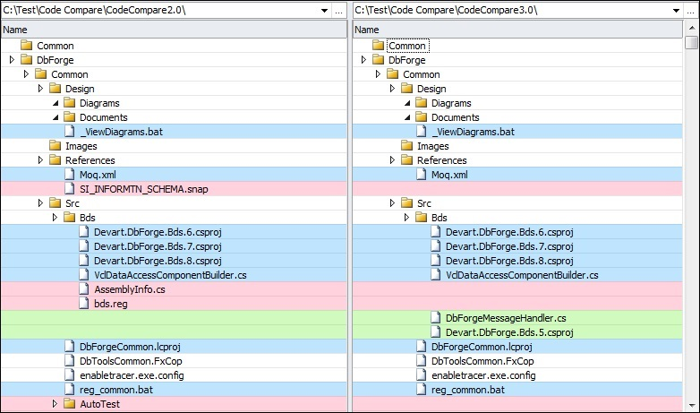

# Product Requirements Document: folder-diff

## Introduction

"folder-diff" is a command-line tool developed in Golang that compares all file differences between two specified folders. It supports comparison based on both hash values and filenames, generating an HTML report that visually represents the differences using file trees and color-coding.

## Objectives

- Provide an efficient and accurate method to compare two folders.
- Support multiple comparison modes (hash and filename).
- Generate a user-friendly HTML report for analysis.

## Features

### 1. File Comparison

- **Description**: Compare all files between two folders.
- **Details**:
  - Recursively scan both folders, including subdirectories.
  - Identify identical files, modified files, new files, and deleted files.

### 2. Comparison Modes

- **Hash-Based Comparison**:
  - Use cryptographic hash functions (e.g., MD5, SHA256) to compare file contents.
  - Detect changes even if filenames remain the same.
- **Filename-Based Comparison**:
  - Compare files based solely on their names.
  - Faster comparison when file content validation is unnecessary.

### 3. Command-Line Interface (CLI)

- **Description**: Provide a user-friendly CLI for tool operation.
- **Options**:
  - Specify folders to compare: `folder-diff /path/to/folder1 /path/to/folder2`
  - Select comparison mode: `--mode=hash` or `--mode=filename`
  - Additional flags:
    - Exclude certain files or directories: `--exclude`
    - Verbose output: `--verbose`

### 4. HTML Report Generation

- **Description**: Generate an HTML document displaying the comparison results.
- **Details**:
  - Visual representation of both folder structures using file trees.
  - Differing files highlighted with distinct colors or markers:
    - **Green**: Identical files
    - **Red**: Modified files
    - **Blue**: New files
    - **Gray**: Deleted files
  - Reference display style similar to the example below:
  
    

  - **Interactive Elements**:
    - Default state with file trees collapsed.
    - Click to expand or collapse folders.
    - Icons sourced from Font Awesome.
    - Different icons for files/folders with differences.
    - Click on files to view detailed differences.

## User Interface Design

- **HTML Report**:
  - Clean and intuitive layout.
  - Legend explaining color codes and symbols.
  - Responsive design compatible with common web browsers.

## Technical Requirements

- **Performance**:
  - Efficient processing for large directories.
  - Optimize hashing algorithms for speed.
- **Platform Compatibility**:
  - Cross-platform support (Linux, macOS, Windows).

## Assumptions

- Users have read permissions for all files and folders being compared.
- Golang environment
